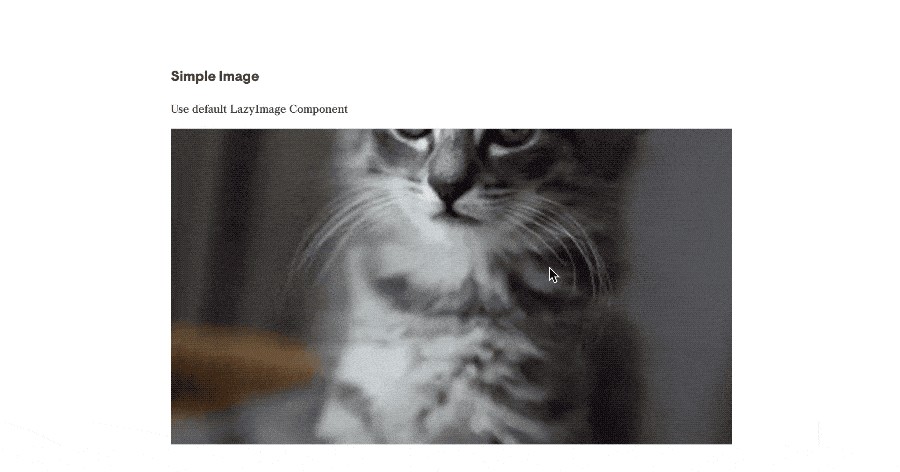

# nuxt-lazyimage

[![npm version][npm-version-src]][npm-version-href]
[![npm downloads][npm-downloads-src]][npm-downloads-href]
[![License][license-src]][license-href]


This module offers you a `<LazyImage>` Component which handles lazy loading for images. 

⚠️ Please note that this module has an dependency to `@bazzite/nuxtoptimizied-images` module. 


## Demo



* [CodeSandbox Example](https://codesandbox.io/embed/nuxt-lazyimage-example-ix4x5)
* [Example Code](https://github.com/regenrek/nuxt-lazyimage-example)

## Features

* Lazy Loading is enabled through popular [lazysizes](https://github.com/aFarkas/lazysizes) library.
* Since we're using [nuxt-optimizied-images](https://github.com/bazzite/nuxt-optimized-images) under the hood you will get optimizied images out of the box.

## 🎯 Install

```bash
yarn add nuxt-lazyimage @bazzite/nuxt-optimized-images
# npm install nuxt-lazyimage nuxt-optimizied-images
```

As described in the `nuxt-optimized-images` module [documentation](https://github.com/bazzite/nuxt-optimized-images#optimization-packages) you need to install the appropiate loaders for your project.

```bash
yarn add -D responsive-loader imagemin-mozjpeg webp-loader lqip-loader
# npm install --save-dev responsive-loader imagemin-mozjpeg webp-loader
```

Add modules to  `nuxt.config.js`

```js
{
  modules: [
    // Simple usage
    'nuxt-lazyimage',
    '@bazzite/nuxt-optimized-images',

    // With options
    ['nuxt-lazyimage', { /* module options */ }],
    ['@bazzite/nuxt-optimized-images', { /* module options */ }],
  ]
}
```

## 📌 Configuration

```js
{
  lazyImage: {
    defaultCss: true // should defaultCSS be included?
  }
},
```

## 🚀 Usage


⚠️ **Important** The reason why you need to set the width and height manually is that I want to avoid fixed CSS heights or js width/height calculations. The way I do it is mainly via [CSS aspect-ratios](https://css-tricks.com/snippets/sass/maintain-aspect-ratio-mixin/). You can see an implementation in the current [example] code (https://github.com/regenrek/nuxt-lazyimage-example) or you can dig older examples here on [Codepen](https://codepen.io/kkern/pen/LKmvjx), [Codesandbox](https://codesandbox.io/embed/nuxt-lazyimage-example-ix4x5) and [nuxt-lazysizes-aspect-ratio-blur](https://github.com/regenrek/nuxt-lazysizes-aspect-ratio-blur).

### Simple Usage


Simple Example with __default path__ `~/assets/images/cat.jpg`
> Notice: Aspect-Ratio is a custom class which isn't included - read above
```html
<LazyImage data-src="cat.jpg" class="aspect-ratio-16/9" />
```

You can use some __external__ image url too
```html
<LazyImage data-src="https://placekitten.com/1200/800" class="aspect-ratio-16/9" />
```

Load an image through some __path__.
> Be careful you need to use `require()` for this scenario [nuxt.js#448](https://github.com/nuxt/nuxt.js/issues/448), [vuejs#202](https://github.com/vuejs/Discussion/issues/202)
```html
<LazyImage data-src="require(`~/assets/media-folder/dog.jpg`)" class="aspect-ratio-16/9" :ignore-img-base-path="true" />
```

### Smooth Parallax Scrolling

If you like smooth scrolling for your images you can combine [locomotive-scroll](https://locomotivemtl.github.io/locomotive-scroll/) with `nuxt-lazyimage`.

Simple smooth scroll
```html
 <LazyImage
    data-src="cat.jpg"
    class="aspect-ratio-16/9"
    smooth-scroll-type="outside"
  />
```

Add more scrolling speed (even negative)
```html
 <LazyImage
    data-src="cat.jpg"
    class="aspect-ratio-16/9"
    smooth-scroll-type="outside"
    scroll-speed="-3"
  />
```

You can also add some nice effect with inside scrolling
```html
<LazyImage
  data-src="cat.jpg"
  class="aspect-ratio-16/9"
  smooth-scroll-type="inside"
  scroll-speed="1"
/>
```

### Viewport Transition Effects

Simple fade in effect for your image
```html
<LazyImage
  data-src="cat.jpg"
  class="aspect-ratio-16/9 a-fadein"
  effect="a-fadein"
/>
```

Some more effects...
```html
<LazyImage
  data-src="cat.jpg"
  class="aspect-ratio-16/9"
  effect="a-reveal a-reveal-left-to-right"
/>
<LazyImage
  data-src="cat.jpg"
  class="aspect-ratio-16/9"
  effect="a-reveal a-reveal-top-to-bot"
/>
```

⚠️ **Important**  Unfortunately transitions and smooth-scrolling are currently tightly coupled to [locomotive-scroll](https://locomotivemtl.github.io/locomotive-scroll/) viewport library which I personally prefer using atm. That means you definitly need a custom library that gives you an active class on the element if the image scrolls into the current viewport. Also the `animations.css` file uses `is-inview` class from locomotive.

To get it work with other viewport libraries you need to tweak some elements inside the Component. Or you just wrap the `<LazyImage />` with some custom directive and code the animation right away. For example [Akryum/vue-observer-visibility](https://github.com/Akryum/vue-observe-visibility) works very well.

I think this needs some refactoring to be able to set your `active` classes yourself - feel free to adapt.

### Use lqip with blur-up technique

Example with lqip-loader
> You need to install `lqip-loader` first!
```html
<LazyImage data-src="cat.jpg" :use-lqip="true" />
```

### Some more examples

Choose between object-fit: cover and contain.
> It uses `lazysizes/plugins/object-fit/ls.object-fit` behind the scene
```html
<LazyImage data-src="cat.jpg" objectFit="contain" />
<LazyImage data-src="cat.jpg" objectFit="cover" /> <!-- default -->
```

## API Reference

### Props

<!-- @vuese:LazyImage:props:start -->

|Name|Description|Type|Required|Default|
|---|---|---|---|---|
|dataSrc|The image URL you want to show|`'cat.jpg'`|`true`|-|
|objectFit|Specify how the image/video will fit the container|`'cover'` / `'contain'`|`false`|'cover'|
|smoothScrollType|Enable animation wrapper. Works currently only with locomotive library|`'none'` / `'outside'` / `'inside'`|`false`|'none'|
|effect|Define the animation effect you want to use|`'a-reveal'` / `'a-fadein'` / `'custom'`|`false`|''|
|scrollSpeed|Everything > 0 gets an smooth parallax scroll. Works only with locomotive library!|`String`|`false`|'0'|
|ignoreImgBasePath|The default path is ~/assets/images.|`Boolean`|`false`|false|
|useSrcSet|If you disable this prop you will get a simple  tag|`Boolean`|`false`|true|
|useLqip|Use LQIP/blurry image placeholder/Blur up image technique. Needs lqip-loader|`Boolean`|`false`|false|


<!-- @vuese:LazyImage:props:end -->


### Slots

<!-- @vuese:LazyImage:slots:start -->
|Name|Description|Default Slot Content|
|---|---|---|
|default|-|-|

<!-- @vuese:LazyImage:slots:end -->


## Roadmap

1. Add more flexibility for different viewport libraries
2. Add possibility to use more custom attributes (like scroll-orientation)

## Development

1. Clone this repository
2. Install dependencies using `yarn install` or `npm install`
3. Start development server using `npm run dev`

## Issues

* Currently there is no SSR Support !

## License

[MIT License](./LICENSE)

Copyright (c) Kevin Regenrek <hello@regenrek.at>

<!-- Badges -->
[npm-version-src]: https://img.shields.io/npm/v/nuxt-lazyimage/latest.svg?style=flat-square
[npm-version-href]: https://npmjs.com/package/nuxt-lazyimage

[npm-downloads-src]: https://img.shields.io/npm/dt/nuxt-lazyimage.svg?style=flat-square
[npm-downloads-href]: https://npmjs.com/package/nuxt-lazyimage

[circle-ci-src]: https://img.shields.io/circleci/project/github/regenrek/nuxt-lazyimage.svg?style=flat-square
[circle-ci-href]: https://circleci.com/gh/regenrek/nuxt-lazyimage

[codecov-src]: https://img.shields.io/codecov/c/github/regenrek/nuxt-lazyimage.svg?style=flat-square
[codecov-href]: https://codecov.io/gh/regenrek/nuxt-lazyimage

[license-src]: https://img.shields.io/npm/l/nuxt-lazyimage.svg?style=flat-square
[license-href]: https://npmjs.com/package/nuxt-lazyimage
